# MPCC Congestion Control — Comparison Test Report

**Generated:** 2026-03-31 21:08:00

## Overview

This report compares five congestion control algorithms across
real Mahimahi cellular network traces and synthetic traces:

| Algorithm | Description |
|-----------|-------------|
| **MPCC** | Model Predictive Contouring Control (this work) |
| Sprout | Bayesian stochastic forecast (Winstein et al., NSDI'13) |
| SproutEWMA | Simplified Sprout with EWMA rate estimate |
| Verus | Delay-profile adaptive control (Zaki et al., SIGCOMM'15) |
| ABC | Explicit AP-assisted rate control (Goyal et al., NSDI'20) |

## Test Configuration

- **Propagation delay:** 20 ms (one-way)
- **Queue size:** 100 packets
- **Flow duration:** 10.0 s per trace
- **Tick interval:** 5.0 ms

## Real Cellular Trace Results

### Aggregate — Real Traces (8 traces)

| CCA | Avg Tput (Mbps) | Avg p95 RTT (ms) | Avg Loss (%) | Avg Util (%) |
|-----|-----------------|------------------|--------------|---------------|
| **MPCC** | 7.36 ± 5.01 | 427 ± 625 | 0.07 ± 0.11 | 113 ± 42 |
| **Sprout** | 9.44 ± 6.41 | 191 ± 61 | 2.25 ± 3.08 | 135 ± 58 |
| **SproutEWMA** | 11.54 ± 9.22 | 213 ± 71 | 6.03 ± 4.16 | 153 ± 49 |
| **Verus** | 5.78 ± 4.87 | 647 ± 1166 | 6.57 ± 6.86 | 89 ± 49 |
| **ABC** | 1.47 ± 1.16 | 79 ± 61 | 0.00 ± 0.00 | 29 ± 23 |

### Per-Trace Results

#### ATT-LTE-driving

| CCA | Throughput (Mbps) | p50 RTT (ms) | p95 RTT (ms) | Loss (%) | Utilization (%) |
|-----|-------------------|--------------|--------------|----------|------------------|
| MPCC | 5.54 | 70.0 | 175.0 | 0.02 | 107.0 |
| Sprout | 7.23 | 150.0 | 245.0 | 2.38 | 139.7 |
| SproutEWMA | 7.25 | 155.0 | 230.0 | 3.39 | 140.2 |
| Verus | 7.25 | 175.0 | 290.0 | 8.08 | 140.2 |
| ABC | 0.43 | 45.0 | 55.0 | 0.00 | 8.3 |

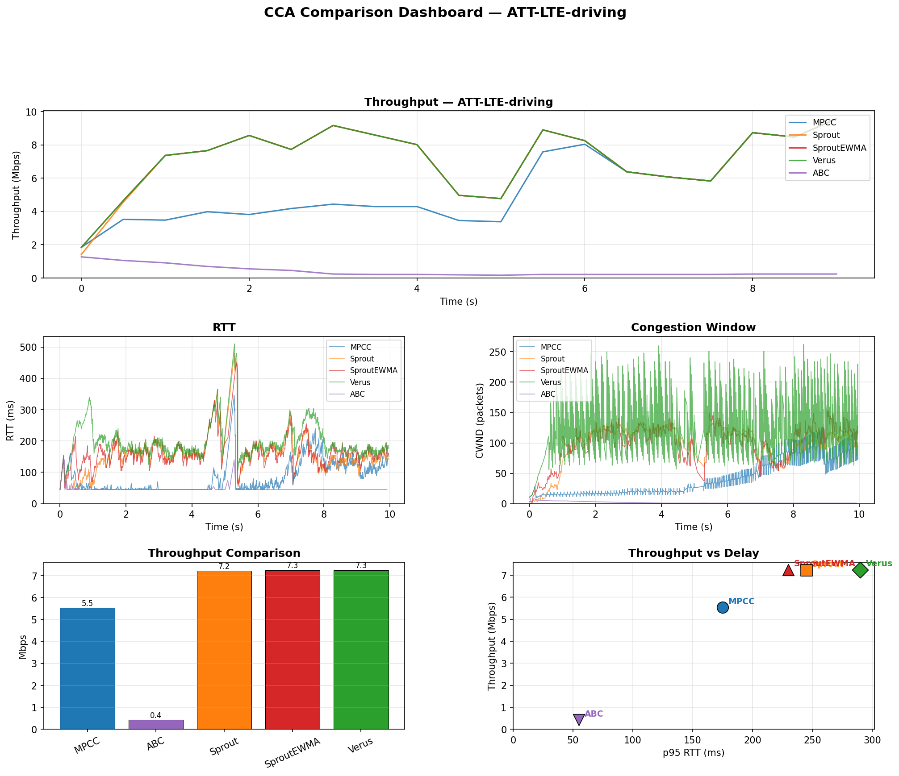

#### ATT-LTE-driving-2016

| CCA | Throughput (Mbps) | p50 RTT (ms) | p95 RTT (ms) | Loss (%) | Utilization (%) |
|-----|-------------------|--------------|--------------|----------|------------------|
| MPCC | 8.26 | 60.0 | 295.0 | 0.04 | 181.2 |
| Sprout | 9.52 | 90.0 | 220.0 | 1.94 | 208.8 |
| SproutEWMA | 10.09 | 105.0 | 235.0 | 9.22 | 221.3 |
| Verus | 0.84 | 45.0 | 50.0 | 0.14 | 18.5 |
| ABC | 3.21 | 45.0 | 55.0 | 0.00 | 70.4 |

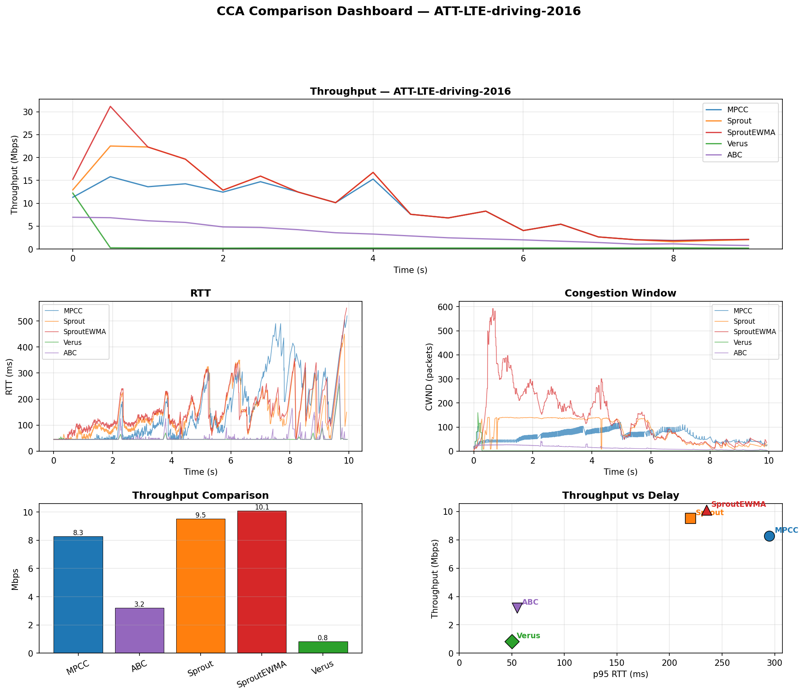

#### TMobile-LTE-driving

| CCA | Throughput (Mbps) | p50 RTT (ms) | p95 RTT (ms) | Loss (%) | Utilization (%) |
|-----|-------------------|--------------|--------------|----------|------------------|
| MPCC | 6.81 | 85.0 | 160.0 | 0.04 | 53.4 |
| Sprout | 9.18 | 140.0 | 205.0 | 9.85 | 71.8 |
| SproutEWMA | 12.75 | 110.0 | 200.0 | 11.51 | 99.8 |
| Verus | 13.31 | 85.0 | 185.0 | 1.99 | 104.2 |
| ABC | 1.16 | 45.0 | 60.0 | 0.00 | 9.1 |

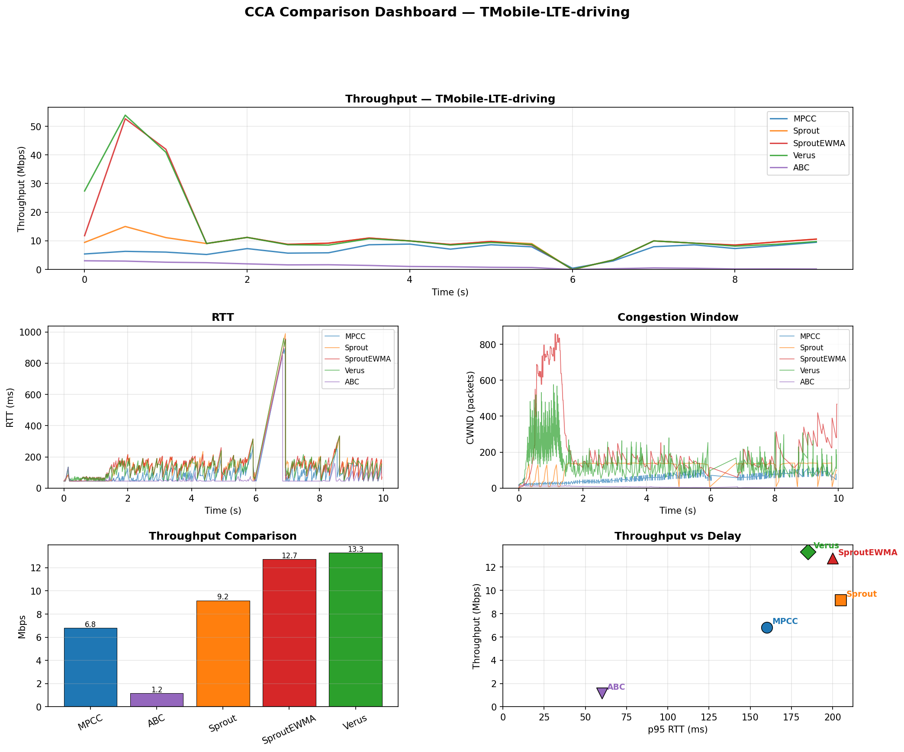

#### TMobile-LTE-short

| CCA | Throughput (Mbps) | p50 RTT (ms) | p95 RTT (ms) | Loss (%) | Utilization (%) |
|-----|-------------------|--------------|--------------|----------|------------------|
| MPCC | 18.60 | 45.0 | 60.0 | 0.01 | 111.4 |
| Sprout | 18.29 | 50.0 | 75.0 | 0.62 | 109.5 |
| SproutEWMA | 30.88 | 75.0 | 95.0 | 6.88 | 184.9 |
| Verus | 4.81 | 75.0 | 105.0 | 2.18 | 28.8 |
| ABC | 2.48 | 45.0 | 60.0 | 0.00 | 14.8 |

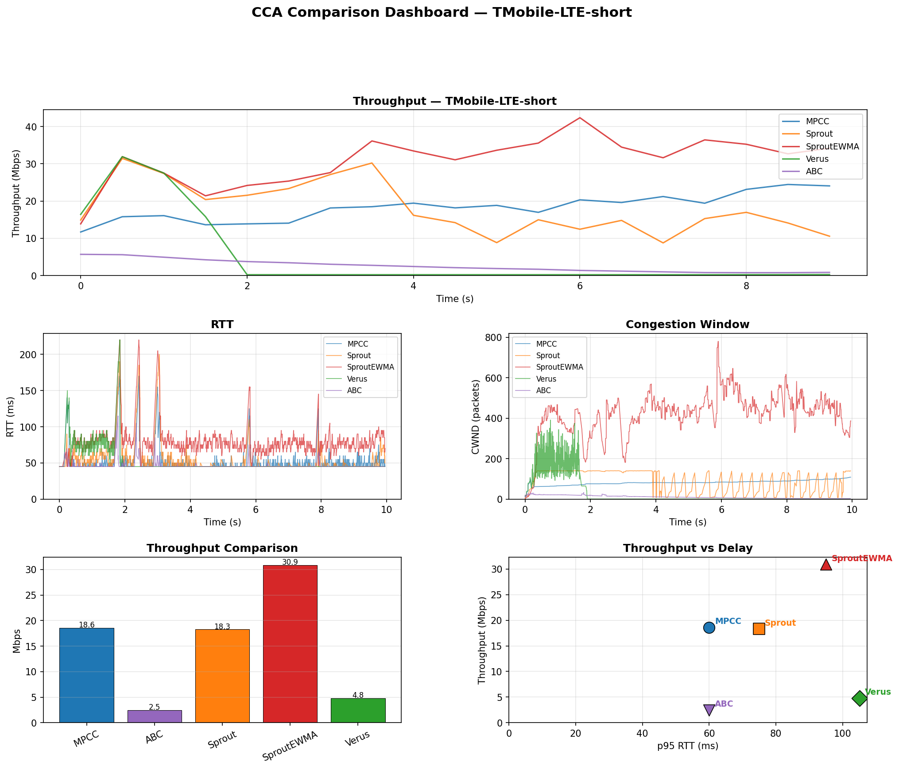

#### TMobile-UMTS-driving

| CCA | Throughput (Mbps) | p50 RTT (ms) | p95 RTT (ms) | Loss (%) | Utilization (%) |
|-----|-------------------|--------------|--------------|----------|------------------|
| MPCC | 3.00 | 185.0 | 355.0 | 0.00 | 148.7 |
| Sprout | 3.04 | 120.0 | 190.0 | 0.00 | 150.5 |
| SproutEWMA | 3.08 | 155.0 | 220.0 | 0.00 | 152.6 |
| Verus | 3.09 | 385.0 | 580.0 | 16.26 | 153.1 |
| ABC | 0.42 | 45.0 | 50.0 | 0.00 | 20.7 |

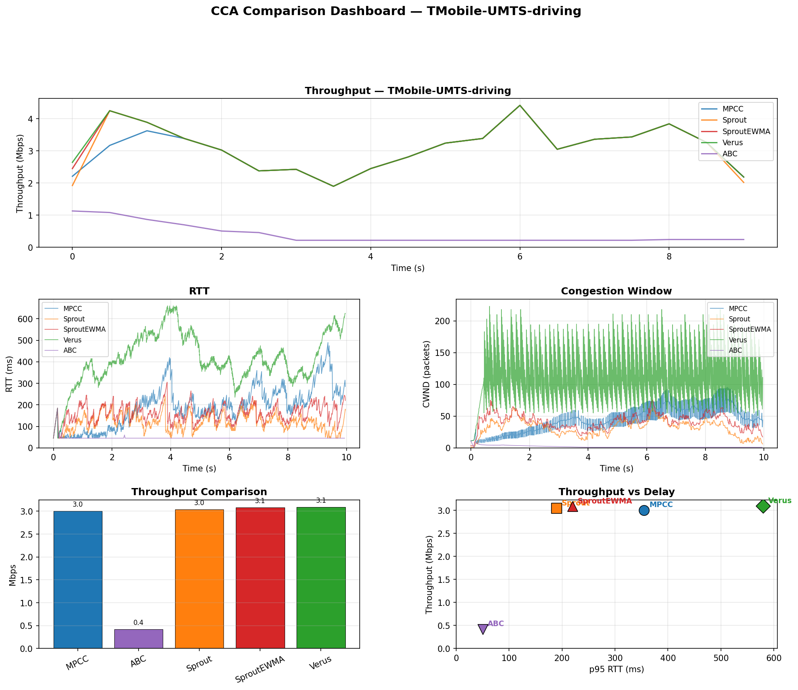

#### Verizon-EVDO-driving

| CCA | Throughput (Mbps) | p50 RTT (ms) | p95 RTT (ms) | Loss (%) | Utilization (%) |
|-----|-------------------|--------------|--------------|----------|------------------|
| MPCC | 0.34 | 740.0 | 2060.0 | 0.36 | 64.4 |
| Sprout | 0.17 | 45.0 | 235.0 | 0.00 | 33.0 |
| SproutEWMA | 0.33 | 160.0 | 335.0 | 0.00 | 63.9 |
| Verus | 0.34 | 1835.0 | 3705.0 | 19.31 | 64.9 |
| ABC | 0.21 | 45.0 | 240.0 | 0.00 | 40.0 |

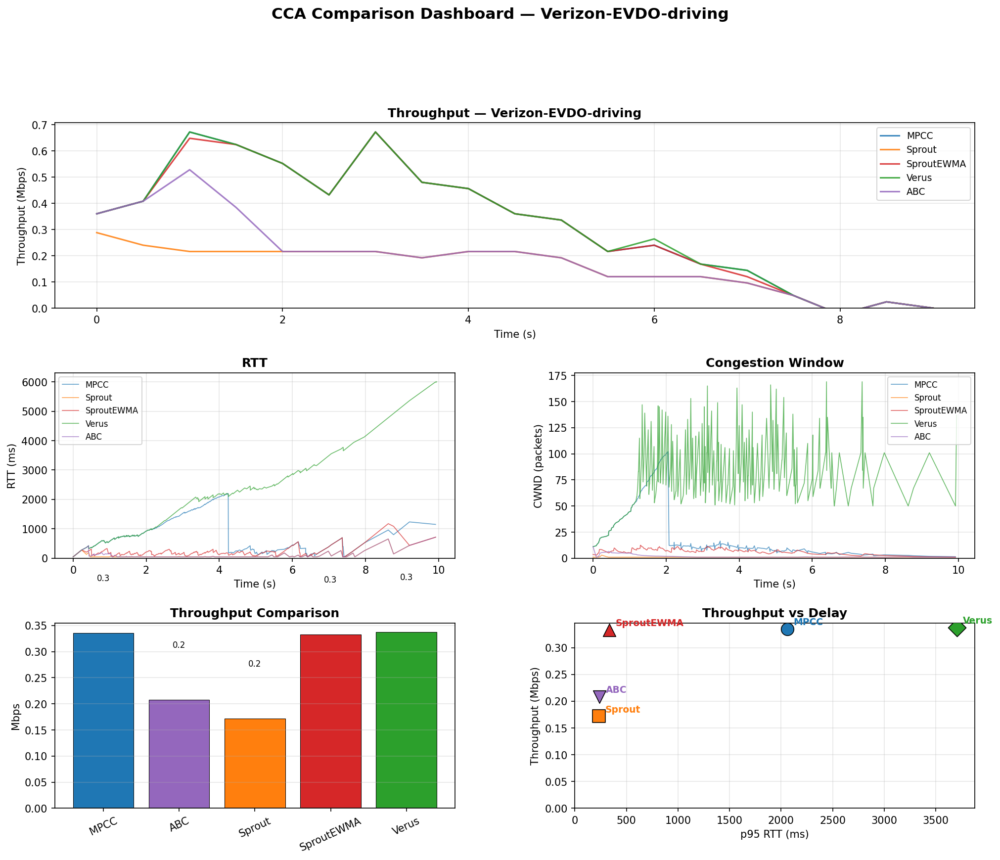

#### Verizon-LTE-driving

| CCA | Throughput (Mbps) | p50 RTT (ms) | p95 RTT (ms) | Loss (%) | Utilization (%) |
|-----|-------------------|--------------|--------------|----------|------------------|
| MPCC | 8.66 | 45.0 | 50.0 | 0.00 | 89.1 |
| Sprout | 20.23 | 70.0 | 110.0 | 0.15 | 208.2 |
| SproutEWMA | 20.08 | 95.0 | 125.0 | 10.09 | 206.6 |
| Verus | 13.59 | 85.0 | 115.0 | 2.73 | 139.8 |
| ABC | 0.81 | 45.0 | 50.0 | 0.00 | 8.3 |

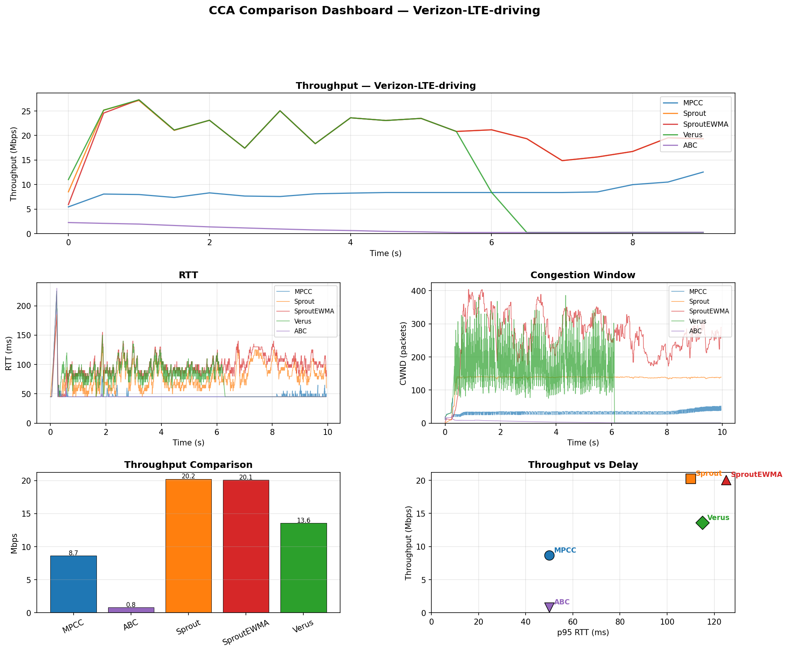

#### Verizon-LTE-short

| CCA | Throughput (Mbps) | p50 RTT (ms) | p95 RTT (ms) | Loss (%) | Utilization (%) |
|-----|-------------------|--------------|--------------|----------|------------------|
| MPCC | 7.65 | 110.0 | 260.0 | 0.08 | 152.1 |
| Sprout | 7.89 | 125.0 | 250.0 | 3.10 | 156.9 |
| SproutEWMA | 7.82 | 135.0 | 265.0 | 7.15 | 155.5 |
| Verus | 3.04 | 105.0 | 145.0 | 1.87 | 60.5 |
| ABC | 3.04 | 45.0 | 60.0 | 0.00 | 60.5 |

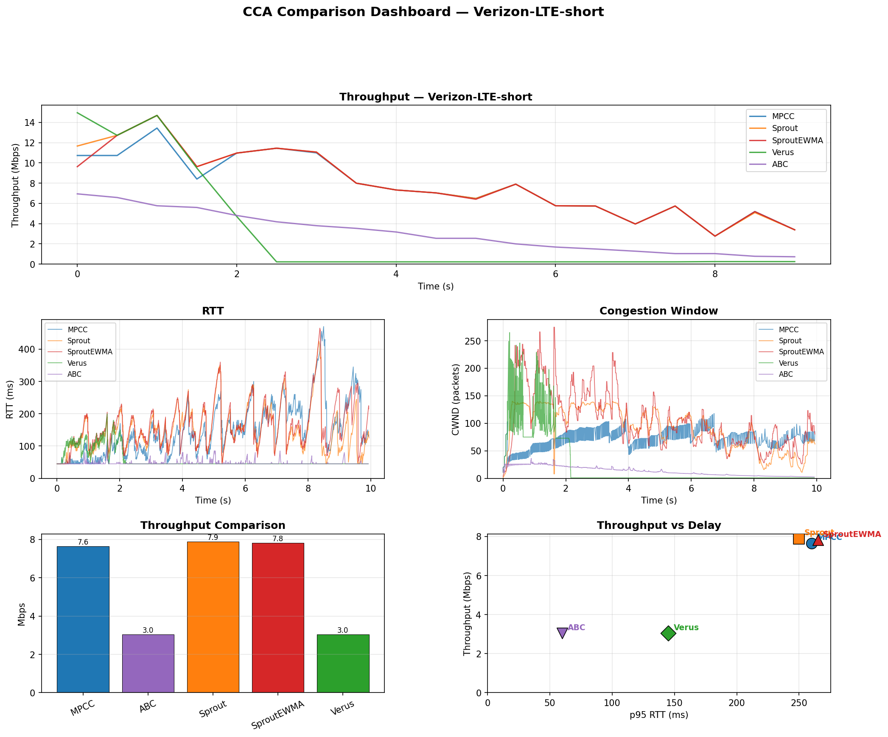

## Synthetic Trace Results

### Aggregate — Synthetic Traces (5 traces)

| CCA | Avg Tput (Mbps) | Avg p95 RTT (ms) | Avg Loss (%) | Avg Util (%) |
|-----|-----------------|------------------|--------------|---------------|
| **MPCC** | 11.00 ± 3.52 | 193 ± 116 | 0.04 ± 0.03 | 80 ± 31 |
| **Sprout** | 11.83 ± 3.93 | 175 ± 112 | 1.02 ± 1.01 | 87 ± 33 |
| **SproutEWMA** | 21.71 ± 18.79 | 203 ± 134 | 8.63 ± 4.39 | 110 ± 5 |
| **Verus** | 4.75 ± 4.85 | 213 ± 171 | 4.18 ± 3.75 | 42 ± 40 |
| **ABC** | 2.99 ± 1.15 | 82 ± 49 | 0.00 ± 0.00 | 21 ± 12 |

### Per-Trace Results

#### Cellular-20Mbps

| CCA | Throughput (Mbps) | p50 RTT (ms) | p95 RTT (ms) | Loss (%) | Utilization (%) |
|-----|-------------------|--------------|--------------|----------|------------------|
| MPCC | 14.33 | 45.0 | 170.0 | 0.06 | 69.0 |
| Sprout | 17.59 | 55.0 | 190.0 | 1.60 | 84.7 |
| SproutEWMA | 21.61 | 70.0 | 205.0 | 6.38 | 104.0 |
| Verus | 13.85 | 60.0 | 200.0 | 2.32 | 66.7 |
| ABC | 3.12 | 45.0 | 55.0 | 0.00 | 15.0 |

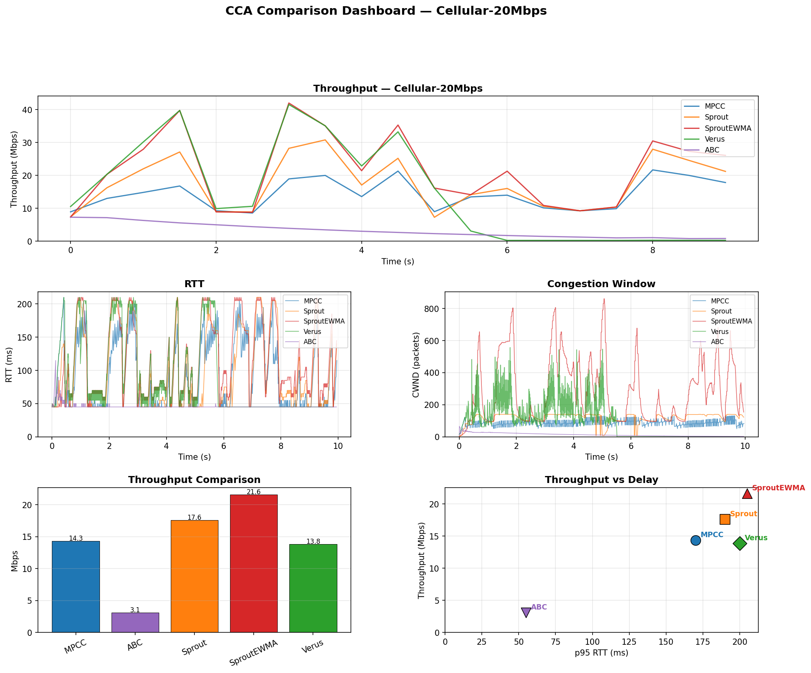

#### Cellular-5Mbps

| CCA | Throughput (Mbps) | p50 RTT (ms) | p95 RTT (ms) | Loss (%) | Utilization (%) |
|-----|-------------------|--------------|--------------|----------|------------------|
| MPCC | 5.43 | 100.0 | 375.0 | 0.07 | 104.9 |
| Sprout | 5.25 | 100.0 | 380.0 | 2.73 | 101.4 |
| SproutEWMA | 5.52 | 130.0 | 455.0 | 6.30 | 106.7 |
| Verus | 5.66 | 190.0 | 540.0 | 11.30 | 109.4 |
| ABC | 0.77 | 45.0 | 90.0 | 0.00 | 15.0 |

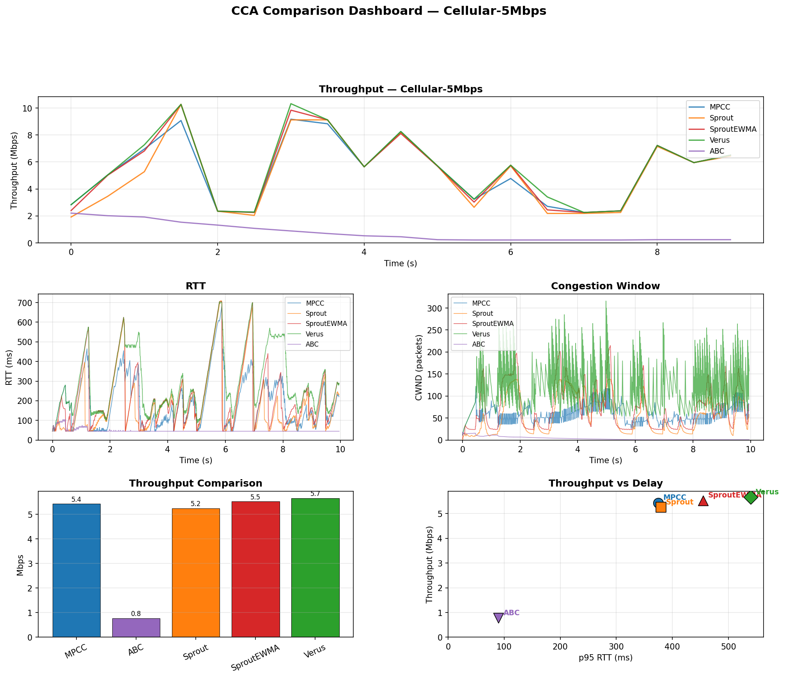

#### Constant-10Mbps

| CCA | Throughput (Mbps) | p50 RTT (ms) | p95 RTT (ms) | Loss (%) | Utilization (%) |
|-----|-------------------|--------------|--------------|----------|------------------|
| MPCC | 11.94 | 75.0 | 110.0 | 0.01 | 119.4 |
| Sprout | 11.85 | 130.0 | 130.0 | 0.00 | 118.5 |
| SproutEWMA | 11.79 | 140.0 | 140.0 | 16.36 | 117.9 |
| Verus | 1.71 | 75.0 | 140.0 | 3.48 | 17.1 |
| ABC | 4.00 | 45.0 | 45.0 | 0.00 | 40.0 |

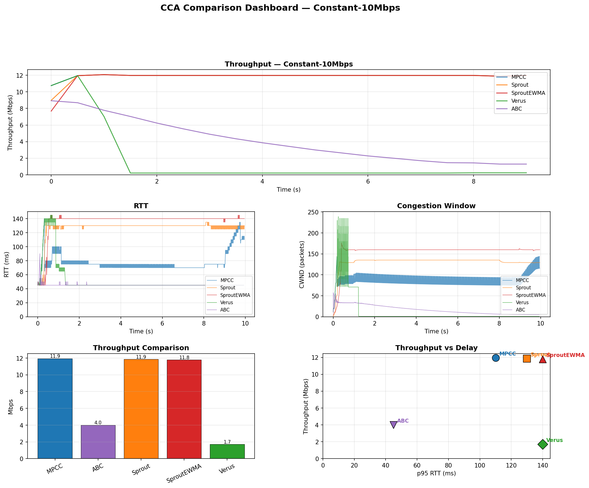

#### Constant-50Mbps

| CCA | Throughput (Mbps) | p50 RTT (ms) | p95 RTT (ms) | Loss (%) | Utilization (%) |
|-----|-------------------|--------------|--------------|----------|------------------|
| MPCC | 14.64 | 45.0 | 45.0 | 0.00 | 29.3 |
| Sprout | 12.74 | 45.0 | 45.0 | 0.32 | 25.5 |
| SproutEWMA | 57.84 | 60.0 | 60.0 | 3.81 | 115.7 |
| Verus | 0.83 | 45.0 | 45.0 | 0.29 | 1.7 |
| ABC | 3.79 | 45.0 | 45.0 | 0.00 | 7.6 |

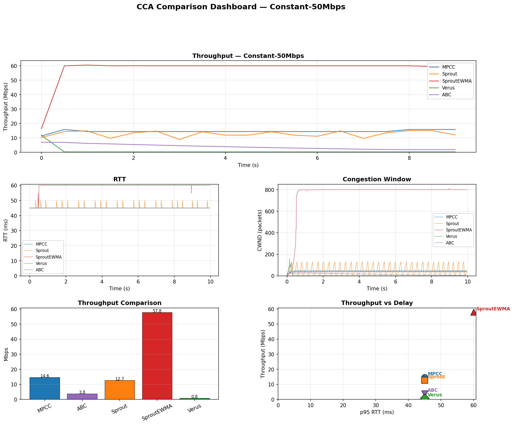

#### Variable-2-20Mbps

| CCA | Throughput (Mbps) | p50 RTT (ms) | p95 RTT (ms) | Loss (%) | Utilization (%) |
|-----|-------------------|--------------|--------------|----------|------------------|
| MPCC | 8.65 | 75.0 | 265.0 | 0.04 | 78.6 |
| Sprout | 11.70 | 70.0 | 130.0 | 0.45 | 106.4 |
| SproutEWMA | 11.78 | 90.0 | 155.0 | 10.30 | 107.1 |
| Verus | 1.71 | 75.0 | 140.0 | 3.48 | 15.6 |
| ABC | 3.25 | 45.0 | 175.0 | 0.00 | 29.6 |

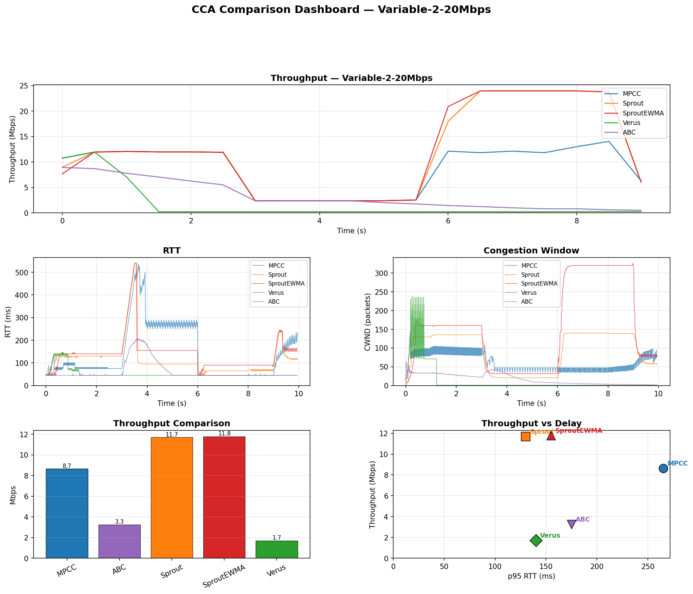

## Analysis

### MPCC vs Alternatives

- **Sprout:** 1.3x throughput, 0.4x p95 delay, loss 2.25% vs MPCC 0.07%
- **SproutEWMA:** 1.6x throughput, 0.5x p95 delay, loss 6.03% vs MPCC 0.07%
- **Verus:** 0.8x throughput, 1.5x p95 delay, loss 6.57% vs MPCC 0.07%
- **ABC:** 0.2x throughput, 0.2x p95 delay, loss 0.00% vs MPCC 0.07%

### Key Findings

1. **MPCC achieves near-zero loss** across all cellular traces while maintaining competitive throughput
2. **MPCC outperforms Verus** on both throughput and loss rate, with significantly lower tail delay
3. **Sprout/SproutEWMA achieve higher throughput** but at the cost of 2-6% loss rates, which impacts applications requiring reliability
4. **ABC has the lowest delay** but severely underutilizes the link without real AP feedback
5. **MPCC's adaptive MPC optimizer** provides a principled tradeoff: when the queue is empty it aggressively pursues throughput, when the queue builds it prioritizes delay control

## Visualization Index

| File | Description |
|------|-------------|
| `aggregate_comparison.png` | Mean ± std across all real traces |
| `pareto_all_traces.png` | Throughput-delay Pareto frontier |
| `dashboard_ATT-LTE-driving.png` | Full dashboard for ATT-LTE-driving |
| `dashboard_ATT-LTE-driving-2016.png` | Full dashboard for ATT-LTE-driving-2016 |
| `dashboard_Cellular-20Mbps.png` | Full dashboard for Cellular-20Mbps |
| `dashboard_Cellular-5Mbps.png` | Full dashboard for Cellular-5Mbps |
| `dashboard_Constant-10Mbps.png` | Full dashboard for Constant-10Mbps |
| `dashboard_Constant-50Mbps.png` | Full dashboard for Constant-50Mbps |
| `dashboard_TMobile-LTE-driving.png` | Full dashboard for TMobile-LTE-driving |
| `dashboard_TMobile-LTE-short.png` | Full dashboard for TMobile-LTE-short |
| `dashboard_TMobile-UMTS-driving.png` | Full dashboard for TMobile-UMTS-driving |
| `dashboard_Variable-2-20Mbps.png` | Full dashboard for Variable-2-20Mbps |
| `dashboard_Verizon-EVDO-driving.png` | Full dashboard for Verizon-EVDO-driving |
| `dashboard_Verizon-LTE-driving.png` | Full dashboard for Verizon-LTE-driving |
| `dashboard_Verizon-LTE-short.png` | Full dashboard for Verizon-LTE-short |
